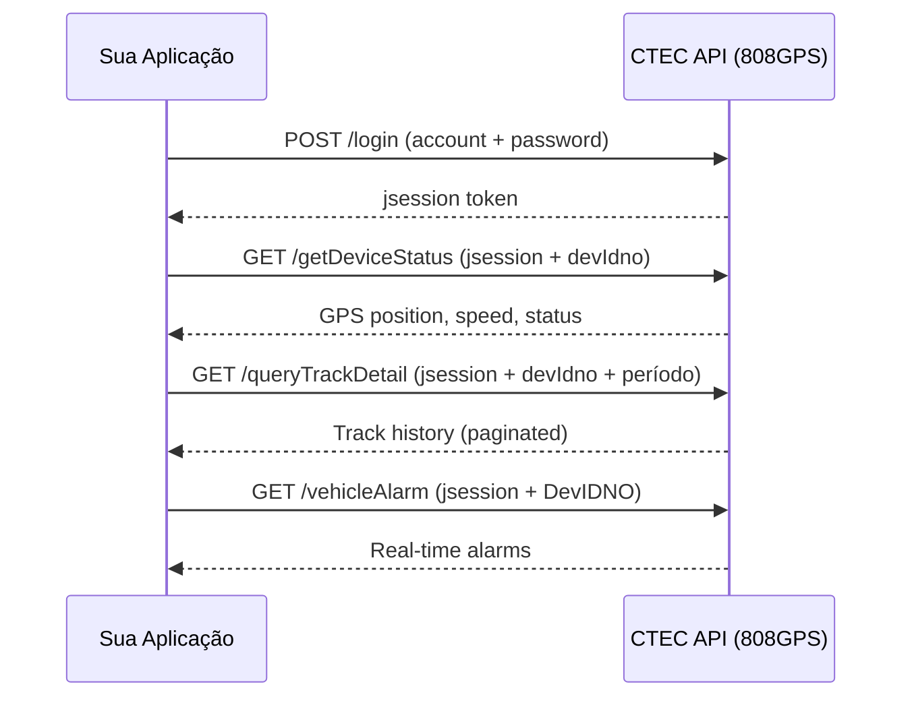

import { Callout, Steps } from 'nextra/components'

# Guia de Integração

Este guia orienta desenvolvedores e integradores na conexão com a plataforma de rastreamento CTEC.

## Fluxo Básico de Integração



## Passo a Passo

### 1. Obter Credenciais

Entre em contato com o suporte CTEC para receber:
- **Usuário** e **Senha** da API
- **URL base** do servidor (produção)
- Lista de **dispositivos autorizados**

### 2. Autenticar

```bash
curl "http://39.100.229.38:8088/StandardApiAction_login.action?account=SEU_USER&password=SUA_SENHA"
```

Guarde o `jsession` retornado. Ele expira após inatividade (~30 min).

### 3. Listar Seus Veículos

```bash
curl "http://39.100.229.38:8088/StandardApiAction_queryUserVehicle.action?jsession=TOKEN"
```

### 4. Monitorar em Tempo Real

```bash
# Posição atual
curl "http://39.100.229.38:8088/StandardApiAction_getDeviceStatus.action?jsession=TOKEN&devIdno=DEVICE&toMap=1"

# Alarmes em tempo real
curl "http://39.100.229.38:8088/StandardApiAction_vehicleAlarm.action?jsession=TOKEN&DevIDNO=DEVICE"
```

### 5. Consultar Histórico

```bash
curl "http://39.100.229.38:8088/StandardApiAction_queryTrackDetail.action?jsession=TOKEN&devIdno=DEVICE&begintime=2026-05-01%2000:00:00&endtime=2026-05-01%2023:59:59&toMap=1"
```

---

## Boas Práticas

### Gerenciamento de Sessão

| Prática | Descrição |
|---------|-----------|
| **Renovar antes de expirar** | Faça login novamente se receber `result: 5` |
| **Não fazer login a cada request** | Reutilize o `jsession` até expirar |
| **Logout ao finalizar** | Libere recursos chamando `/logout` |

### Polling vs Webhook

A API atual é baseada em **polling** (você consulta periodicamente). Recomendações:

| Dado | Intervalo sugerido |
|------|-------------------|
| Posição GPS (tempo real) | 10–30 segundos |
| Status online | 60 segundos |
| Alarmes | 10–15 segundos |
| Quilometragem/relatórios | 1x por hora ou sob demanda |

### Conversão de Coordenadas

As coordenadas retornadas são **WGS84** (padrão GPS). Para exibir em mapas:

| Parâmetro `toMap` | Resultado |
|-------------------|-----------|
| `1` | Coordenadas convertidas para **Google Maps** (GCJ-02) |
| `2` | Coordenadas convertidas para **Baidu Maps** (BD-09) |
| Sem parâmetro | WGS84 bruto (divide por 1.000.000 para graus) |

Para **OpenStreetMap** ou **Mapbox**, use as coordenadas sem `toMap` (WGS84 direto).

### Tratamento de Velocidade e Distância

| Campo | Conversão |
|-------|-----------|
| `sp` (speed) | Dividir por **10** → km/h |
| `lc` (mileage) | Valor em **metros** → dividir por 1000 para km |
| `yl` (fuel) | Dividir por **100** → litros |
| `pk` (park time) | Valor em **segundos** |
| `lng`/`lat` | Dividir por **1.000.000** → graus decimais |

---

## Exemplo Completo (Node.js)

```javascript
const BASE = 'http://39.100.229.38:8088';

class CTECClient {
  constructor(account, password) {
    this.account = account;
    this.password = password;
    this.jsession = null;
  }

  async login() {
    const url = `${BASE}/StandardApiAction_login.action?account=${this.account}&password=${this.password}`;
    const res = await fetch(url);
    const data = await res.json();
    if (data.result !== 0) throw new Error(`Login failed: ${data.result}`);
    this.jsession = data.jsession;
    return this.jsession;
  }

  async getVehicles() {
    const url = `${BASE}/StandardApiAction_queryUserVehicle.action?jsession=${this.jsession}`;
    const res = await fetch(url);
    return res.json();
  }

  async getPosition(devIdno) {
    const url = `${BASE}/StandardApiAction_getDeviceStatus.action?jsession=${this.jsession}&devIdno=${devIdno}&toMap=1`;
    const res = await fetch(url);
    const data = await res.json();
    if (data.result === 5) {
      await this.login(); // re-autenticar
      return this.getPosition(devIdno);
    }
    return data.status?.[0] || null;
  }

  async getTrack(devIdno, begintime, endtime, page = 1) {
    const url = `${BASE}/StandardApiAction_queryTrackDetail.action?jsession=${this.jsession}&devIdno=${devIdno}&begintime=${begintime}&endtime=${endtime}&currentPage=${page}&pageRecords=100&toMap=1`;
    const res = await fetch(url);
    return res.json();
  }
}

// Uso
const client = new CTECClient('meu_usuario', 'minha_senha');
await client.login();
const pos = await client.getPosition('500000');
console.log(`Lat: ${pos.mlat}, Lng: ${pos.mlng}, Speed: ${pos.sp / 10} km/h`);
```

---

## Exemplo Completo (Python)

```python
import requests

BASE = "http://39.100.229.38:8088"

class CTECClient:
    def __init__(self, account: str, password: str):
        self.account = account
        self.password = password
        self.jsession = None

    def login(self):
        r = requests.get(f"{BASE}/StandardApiAction_login.action",
                         params={"account": self.account, "password": self.password})
        data = r.json()
        if data["result"] != 0:
            raise Exception(f"Login failed: {data['result']}")
        self.jsession = data["jsession"]
        return self.jsession

    def get_position(self, dev_idno: str):
        r = requests.get(f"{BASE}/StandardApiAction_getDeviceStatus.action",
                         params={"jsession": self.jsession, "devIdno": dev_idno, "toMap": 1})
        data = r.json()
        if data["result"] == 5:
            self.login()
            return self.get_position(dev_idno)
        return data.get("status", [{}])[0]

    def get_track(self, dev_idno: str, begin: str, end: str, page: int = 1):
        r = requests.get(f"{BASE}/StandardApiAction_queryTrackDetail.action",
                         params={"jsession": self.jsession, "devIdno": dev_idno,
                                 "begintime": begin, "endtime": end,
                                 "currentPage": page, "pageRecords": 100, "toMap": 1})
        return r.json()

# Uso
client = CTECClient("meu_usuario", "minha_senha")
client.login()
pos = client.get_position("500000")
print(f"Lat: {pos['mlat']}, Lng: {pos['mlng']}, Speed: {int(pos['sp'])/10} km/h")
```
